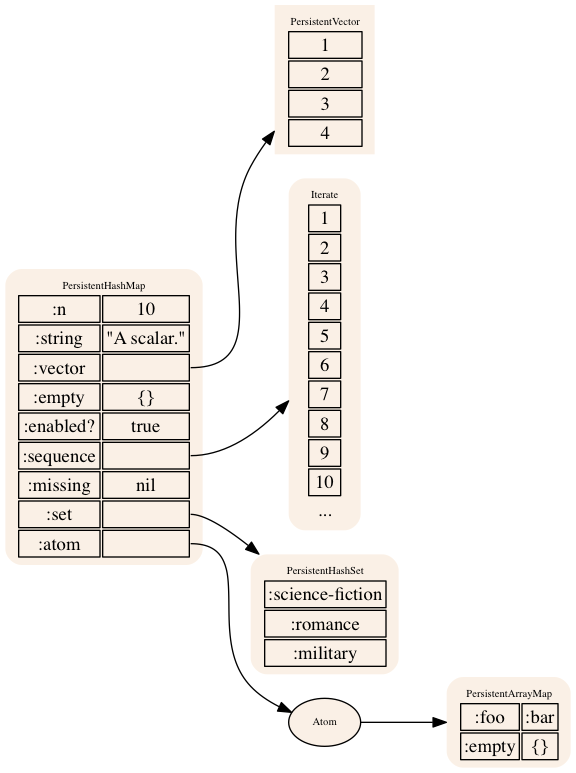

# com.walmartlabs/datascope

A library that can be used to render typical Clojure data structures using
Graphviz.

[API Documentation](http://walmartlabs.github.io/datascope/)

## Usage

Pretty printing 


```
(require '[com.walmartlabs.datascope :as ds])

(ds/view {:missing nil
          :string "A scalar."
          :n 10
          :enabled? true
          :vector [1 2 3 4]
          :sequence (iterate inc 1)
          :atom (atom {:foo :bar :empty {}})
          :empty {}})
```

This will bring up a frame (care of [Rhizome](https://github.com/ztellman/rhizome)])
that displays the following:



* Maps and Sequences have rounded edges, Vectors have square edges.

* The empty map, vector, and sequence are rendered specially.

* No support for sets yet (early days!)

* Refs, such as Atoms and Vars, are supported.

* Sequences are abbreviated; Maps and Vectors are always fully rendered.

* There is not (yet) a limit on how deeply Datascope will recurse through the structures.

Using the rest of the Rhizome API, you can easily save the images to disk
instead of viewing them in a frame.
         
Datascope tries to be smart about rendering collections just once.
If two collections are equal, they will render as a single node.
          
* For sequences (which can be lazy and infinite), the check is for
  identity, not equivalence.
* Maps and vectors with the same value but different meta data will be 
  treated as a single node in the graph.
* (Currently) meta-data is not presented in the graph.  
         

## License

Copyright © 2016 Walmartlabs

Distributed under the terms of the Apache Software License 2.0.
