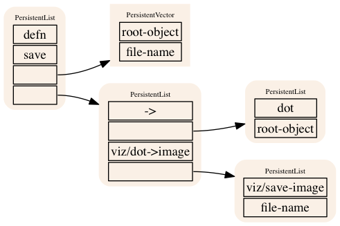

# com.walmartlabs/datascope

A library that can be used to render typical Clojure data structures using
Graphviz.

[API Documentation](http://walmartlabs.github.io/datascope/)

## Usage

Pretty printing can only take you so far; eventually 
a different visual representation is handy for really seeing how all you
data is connected and related.


```
(require '[com.walmartlabs.datascope :as ds])

(ds/view {:missing nil
          :string "A scalar."
          :n 10
          :enabled? true
          :vector [1 2 3 4]
          :sequence (iterate inc 1)
          :set #{:science-fiction :romance :military}
          :atom (atom {:foo :bar :empty {}})
          :empty {}})
```

This will bring up a frame (care of [Rhizome](https://github.com/ztellman/rhizome)])
that displays the following:


* Maps, Sets, and Sequences have rounded edges, Vectors have square edges.

* Composite types are labeled with their (abbreviated) type.

* The empty map, vector, hash, and sequence values are rendered specially.

* Refs, such as Atoms and Vars, are supported.

* Sequences are abbreviated; Maps, Sets, and Vectors are always fully rendered.

* There is not (yet) a limit on how deeply Datascope will recurse through the structures.

Using the rest of the Rhizome API, you can easily save the images to disk
instead of viewing them in a frame.

And, remember, Clojure code is data:


```
(require '[com.walmartlabs.datascope :as ds])

(ds/view 
'(defn save
    [root-object file-name]
    (-> (dot root-object)
      viz/dot->image
      (viz/save-image file-name))))
```



## Upcoming Features

* Optional rendering of meta data

* Depth limit on rendering

* Open up more internal API to support rendering of more types

* Rendering of JavaBeans

## License

Copyright © 2016 Walmartlabs

Distributed under the terms of the Apache Software License 2.0.
